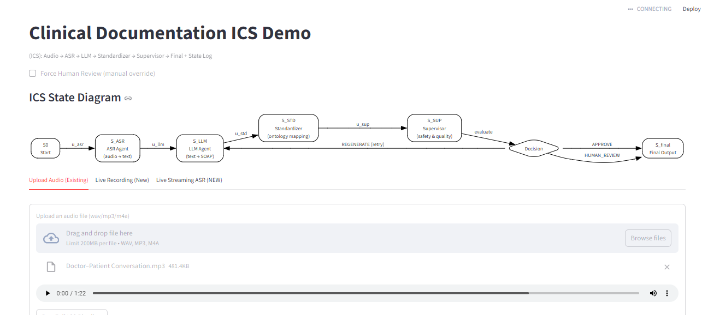
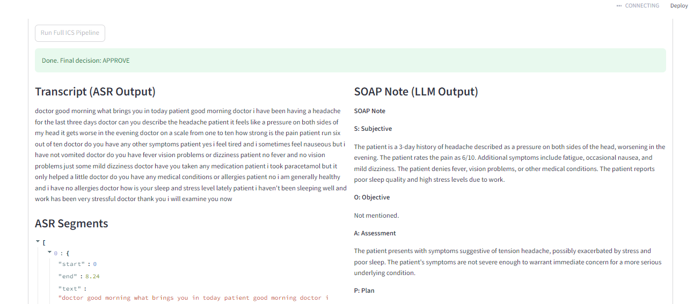
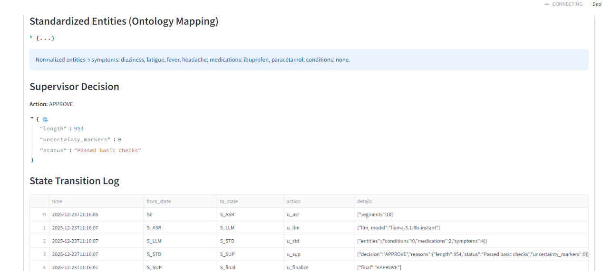

<p align="center">
  
</p>

<p align="center">
  
  
  
  
  
  
</p>


## 🚑 Clinical Documentation ICS Demo

This project presents a **research-oriented Intelligent Control System (ICS)** designed to automate clinical documentation workflows.

The system integrates:
- **Automatic Speech Recognition (ASR)** for doctor–patient conversations
- **Large Language Models (LLMs)** for structured SOAP note generation
- **Ontology-based standardization**
- **Supervisory decision logic** with human-in-the-loop override
- **State-machine–driven execution with full traceability**

The project is implemented as an interactive **Streamlit application** and targets academic research, applied AI systems, and healthcare decision support.

## ✨ Key Features

- 🎙️ **Audio Upload & Live Recording**
- 🧠 **LLM-based SOAP Note Generation**
- 🧩 **Ontology Mapping & Normalization**
- 🛡️ **Supervisor Agent for Quality & Safety**
- 🔁 **Human-in-the-Loop Override**
- 🧭 **Explicit State Machine & Transition Log**
- 📊 **Transparent, Auditable Decision Flow**

---

## 📌 Overview
Research-oriented prototype implementing an **Intelligent Control System (ICS)** for automated clinical documentation.
Processes **doctor–patient conversations** and produces structured **SOAP notes** via a **multi-agent pipeline** with supervision and state transitions.

---

## 🖥️ Application Interface

### Main Interface


### SOAP Note Generation


### State Transition Log



## 🧠 System Architecture


The system follows a **closed-loop control pipeline**:


```

Audio → ASR → LLM → Standardizer → Supervisor → Final Output
↑_____________________________________↓
Feedback & Control

```

### Core Agents

| Agent | Description |
| :--- | :--- |
| ASR Agent | Converts audio to text using Whisper (faster-whisper) |
| LLM Agent | Generates structured SOAP notes using Groq LLaMA |
| Standardizer Agent | Maps free text to canonical medical entities |
| Supervisor Agent | Performs safety and quality checks |
| Control Core | Manages state transitions and decision logging |

---

## 🔁 Intelligent Control Model (ICS)

The system is modeled as a **finite-state intelligent control system**.


### States

* `S0` – Start  
* `S_ASR` – Speech recognition  
* `S_LLM` – Clinical note generation  
* `S_STD` – Ontology-based standardization  
* `S_SUP` – Supervision and decision  
* `S_final` – Final approved output  

### Control Features

* Explicit state transition log
* Supervisor decision (`APPROVE` / `HUMAN_REVIEW`)
* Manual override (Force Human Review)
* Full traceability for research and auditing

---

## 🎙️ Input Modes

### 1) Upload Audio (Offline Mode)

* Upload `.wav`, `.mp3`, or `.m4a` files
* Run the complete ICS pipeline

### 2) Live Recording (Near-Real-Time Mode)

* Record audio directly from the microphone (WebRTC)
* Save the recording as WAV
* Process using the same ICS pipeline
* Designed for future real-time extensions

---

## 🗂️ Project Structure

```text
clinical-doc-ics-demo/
│
├── app/
│   ├── agents/        # ASR / LLM / Standardizer / Supervisor
│   ├── config/        # Settings & environment configuration
│   ├── core/          # Pipeline, state machine, diagrams
│   ├── kb/            # Ontology / knowledge base
│   ├── storage/       # (NEW) audio files, logs, temp artifacts
│   ├── ui/            # Streamlit UI, live recording, streaming
│   └── __init__.py
│
├── docs/
│   ├── API.md         # Public / internal API documentation
│   ├── ARCHITECTURE.md# System architecture & design decisions
│   └── STATES.md      # State machine definitions & transitions
│
├── tests/
│   └── test_pipeline.py
│
├── .env.example
├── .gitignore
├── LICENSE
├── README.md
├── requirements.txt
└── run_streamlit.py
```

## ▶️ 🚀 Quick Start

**1. Create a virtual environment**

```bash
python -m venv .venv
```

Activate the environment:

**Windows**

```bash
.venv\Scripts\activate
```

**Linux / macOS**

```bash
source .venv/bin/activate
```

---

### 2. Install dependencies

```bash
pip install -r requirements.txt
```

---

## 🎧 ASR Configuration (Whisper)

This demo uses **faster-whisper** for efficient local speech recognition.

```bash
ASR_MODEL_SIZE=small        # tiny | base | small | medium
ASR_DEVICE=cpu              # cpu | cuda
ASR_COMPUTE_TYPE=int8       # int8 | float16
```

Optimized for CPU execution on Windows by default.

---

## 🤖 LLM Configuration (Groq)

Create a `.env` file:

```env
GROQ_API_KEY=your_api_key_here
LLM_MODEL=llama-3.1-8b-instant
```

**Important:**
This system does **not perform autonomous medical diagnosis**.
All outputs are **assistive clinical documentation** and must be reviewed by a clinician.

---

## ▶️ Run the Application

```bash
streamlit run app/ui/main.py
```
or

```bash
python run_streamlit.py
```

Open in browser:

```
http://localhost:8501
```

---

## 🧪 Example Outputs

* Full ASR transcript with timestamps
* Structured SOAP clinical note
* Normalized medical entities
* Supervisor decision (`APPROVE` / `HUMAN_REVIEW`)
* State transition log

---

## 🔐 Safety & Ethics

* Human-in-the-loop supervision
* Explicit supervisor control agent
* Manual override support
* No automated diagnosis
* Research and educational use only

---

## 🎓 Research Context

This project supports research in:

* Intelligent Control Systems (ICS)
* Multi-Agent LLM Architectures
* Knowledge-based supervision
* Explainable AI for healthcare
* Human–AI collaboration

Intelligent Control Systems (ICS)

---

MIT License
Free to use for research and educational purposes.

---

## ✨ Author

**Marwan M. Alfalah**
MSc Research Project for NuroScience module Intelligent Systems & Artificial Intelligence

---

## 📌 Future Work
* Streaming ASR with incremental SOAP updates
* Expanded medical knowledge graphs (SNOMED / ICD)
* Reinforcement-learning-based supervisor policies
* PDF / EHR export
* FastAPI backend for production deployment
