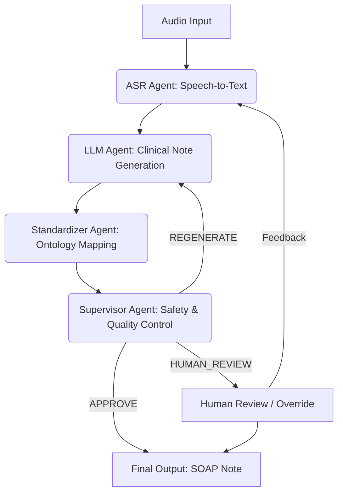

# 🧠 System Architecture
## Intelligent Control System (ICS) for Automated Clinical Documentation

---

## 1. Architectural Overview

This project implements an **Intelligent Control System (ICS)** for automated clinical documentation.
The architecture is designed as a **multi-agent, closed-loop control system** that integrates:

* Speech Recognition (ASR)
* Large Language Models (LLMs)
* Knowledge-based standardization
* Supervisory control with human-in-the-loop
* Explicit state transitions and decision logging

The system transforms **unstructured audio input** (doctor–patient conversation)
into **structured, reviewable clinical documentation** while maintaining control,
traceability, and safety.

---

## 2. High-Level Control Flow

The overall processing pipeline follows a **closed-loop control structure**:




A feedback channel enables **regeneration, supervision, or escalation to human review**
when predefined constraints are violated.

---

## 3. Intelligent Control System (ICS) Model

The system is formally modeled as a **finite-state intelligent control system**:

### 3.1 States

| State | Description |
| --- | --- |
| `S0` | System initialization |
| `S_ASR` | Speech recognition |
| `S_LLM` | Clinical note generation |
| `S_STD` | Ontology-based standardization |
| `S_SUP` | Supervision and decision |
| `S_final` | Final approved output |

### 3.2 State Transitions

Transitions are triggered by **control actions**:

* `u_asr` → audio transcription
* `u_llm` → text-to-SOAP generation
* `u_std` → entity normalization
* `u_sup` → supervisory evaluation
* `u_finalize` → final decision

Each transition is **logged with timestamps and metadata**.

---

## 4. Multi-Agent Architecture

Each processing stage is implemented as an **independent agent** with a clearly defined role.

### 4.1 ASR Agent

**Responsibilities:**

* Convert raw audio into text
* Segment transcription with timestamps
* Handle noisy or imperfect audio input

**Implementation:**

* Whisper via `faster-whisper`
* CPU-optimized execution (int8)

**Output:**

* Full transcript
* Segmented text with timing information

---

### 4.2 LLM Agent

**Responsibilities:**

* Transform transcript into structured SOAP notes
* Summarize clinical information
* Preserve factual consistency

**Implementation:**

* Groq API with LLaMA models

**Output:**

* Structured SOAP note (Subjective, Objective, Assessment, Plan)

> ⚠️ The LLM agent does **not perform autonomous diagnosis**.
> All outputs are assistive and subject to supervision.

---

### 4.3 Standardizer Agent

**Responsibilities:**

* Normalize clinical terms
* Map free text to canonical entities
* Reduce ambiguity and synonym variance

**Knowledge Source:**

* Lightweight medical ontology (`ontology.json`)

**Output:**

* Normalized entities (symptoms, medications, conditions)
* Structured summaries for supervision

---

### 4.4 Supervisor Agent

**Responsibilities:**

* Validate output quality and safety
* Detect hallucinations or missing information
* Decide whether to approve or escalate

**Decision Options:**

* `APPROVE`
* `HUMAN_REVIEW`

**Control Mechanisms:**

* Rule-based checks
* Length constraints
* Uncertainty markers
* Manual override (Force Human Review)

---

## 5. Human-in-the-Loop Control

The system explicitly supports **human-in-the-loop supervision**:

* Manual override at any stage
* Forced human review option
* Transparent decision reasoning
* No automatic clinical decision-making

This design aligns with **ethical AI requirements in healthcare**.

---

## 6. State Machine and Logging

All state transitions are recorded in a **state transition log**:

* Timestamp
* Source state
* Target state
* Control action
* Additional metadata

This enables:

* Full traceability
* Debugging and analysis
* Research reproducibility

---

## 7. User Interface Architecture

The UI is implemented using **Streamlit** and provides:

* Audio upload interface
* Live microphone recording
* Visualization of ICS state diagram
* Display of intermediate and final outputs
* Supervisor decision explanation
* State transition log table

The UI acts as a **control panel** for interacting with the ICS.

---

## 8. Configuration and Environment Control

System behavior is controlled via environment variables:

* ASR model size and compute type
* Device selection (CPU / CUDA)
* LLM model selection
* API credentials

This separation allows:

* Reproducibility
* Easy experimentation
* Hardware adaptability

---

## 9. Safety, Ethics, and Scope

The architecture enforces the following principles:

* No autonomous diagnosis
* Assistive clinical documentation only
* Mandatory clinician review
* Transparent decision-making
* Research and educational usage

---

## 10. Extensibility and Future Evolution

The architecture is designed for extension into:

* Streaming ASR and incremental updates
* Larger medical knowledge graphs (SNOMED, ICD)
* Reinforcement-learning-based supervisor policies
* Backend deployment with FastAPI
* Integration with EHR systems

---

## 11. Summary

This architecture demonstrates how **Intelligent Control Systems** and **Multi-Agent LLM architectures**
can be combined to build **safe, controllable, and explainable AI systems** for healthcare documentation.

It provides a strong foundation for:

* Academic research
* Experimental evaluation
* Future production-grade systems

```

```